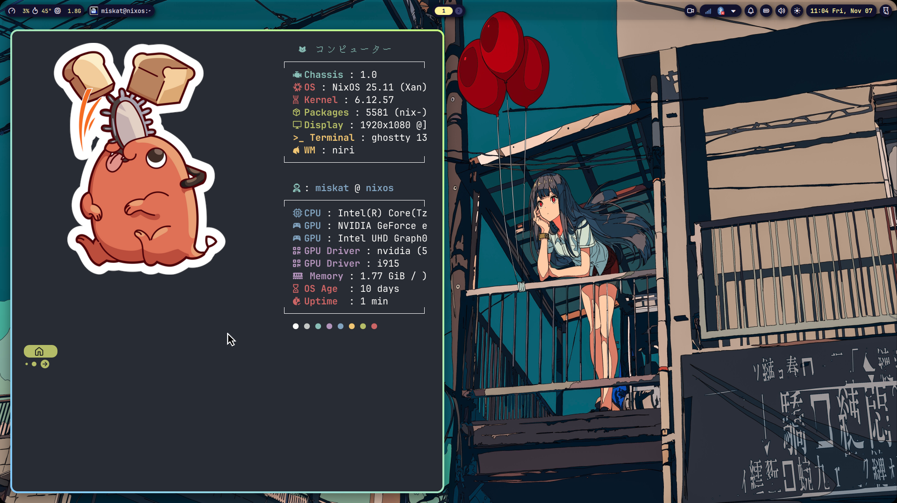

# ❄️ Modular NixOS & Home Manager Dotfiles

[](https://nixos.org)
[](https://github.com/nix-community/home-manager)
[](https://github.com/nix-community/nixvim)
[](https://hyprland.org)
[](https://www.gnome.org)

A modular, reproducible, flake-based NixOS and Home Manager environment featuring **declarative dual desktop profiles** (`miskat-hyprland` and `miskat-gnome`), a **Nixvim IDE**, a **Python AI/ML/DL suite**, and **ZaneyOS glassmorphic design aesthetics**.



---

## 🌟 Architecture Overview

This repository uses a **single-branch, multi-profile Flake architecture** (`flake.nix`). System and user modules are cleanly separated so you can switch desktop environments and software suites declaratively without code duplication or Git branch conflicts.

```
my-dotfiles/
├── flake.nix                 # Flake entry point (miskat-hyprland & miskat-gnome profiles)
├── system/                   # System-level NixOS modules
│   ├── profiles/             # Host profiles (hyprland.nix, gnome.nix, common.nix)
│   ├── core/                 # Bootloader, locale, networking, users, nix options
│   ├── desktop/              # GNOME 47 DE, Hyprland suite, PipeWire audio, fonts
│   ├── hardware/             # Machine hardware & NVIDIA configuration
│   ├── packages/             # CLI, C/C++/gdb, Python AI/ML, Security, Apps
│   └── services/             # Libvirt/QEMU, Flatpak, local LLM (vLLM/llama.cpp)
└── home/
    └── miskat/               # User-level Home Manager modules
        ├── profiles/         # User profiles (hyprland.nix, gnome.nix, common.nix)
        └── modules/          # Feature-specific user configurations
            ├── git.nix       # User Git credentials
            ├── packages.nix  # Zen Browser & user apps
            ├── shell/        # Zsh, Powerlevel10k, Fastfetch, environment
            ├── terminal/     # Kitty (Hyprland profile) & Ghostty (GNOME profile)
            ├── desktop/      # Hyprland, ZaneyOS Waybar, SwayNC, Rofi, Wallpaper
            └── editor/       # Declarative Nixvim IDE configuration
```

---

## 🖥️ Desktop Profiles & Specifications

### 1. `miskat-hyprland` Profile (ZaneyOS Wayland Rice)
- **Window Manager**: Hyprland compositor with ZaneyOS ruleset, active purple/blue glowing borders (`rgba(cba6f7ee) rgba(89b4faee) 45deg`), window animations, and native Lua configuration engine (`configType = "lua"`).
- **Status Bar**: ZaneyOS Curved Glassmorphic Waybar featuring asymmetric bottom curves, floating center workspace pill, and SwayNC control center trigger (`󰂚`).
- **Notifications**: SwayNC (Sway Notification Center) styled with translucent obsidian glass (`rgba(30, 30, 46, 0.88)`), 16px rounded corners, glowing lavender borders (`#cba6f7`), DND toggle, MPRIS media player, and Volume/Brightness sliders.
- **Launcher**: Glassmorphic Rofi with a 2-column grid layout and high-res **Tela-circle-dark** icons.
- **Default Terminal**: **Kitty** with `JetBrainsMono Nerd Font` & Catppuccin Mocha palette (`TERMINAL = "kitty"`).
- **Theme & Cursor**: Catppuccin Mocha Lavender GTK theme, `Tela-circle-dark` icons, `Bibata-Modern-Classic` cursor (24px).
- **Wallpaper**: Static Dracula NixOS wallpaper (`nixos-dracula.png`) applied via `awww`.
- **Screenshots**: `Hyprshot` bindings with automatic directory creation (`~/Pictures/Screenshots/`) and desktop notifications.

### 2. `miskat-gnome` Profile (Pure Desktop Environment)
- **Desktop Environment**: GNOME 47 Desktop Environment + GDM.
- **Default Terminal**: **Ghostty** (`com.mitchellh.ghostty.desktop`, `TERMINAL = "ghostty"`).
- **Theme & Cursor**: Stock GNOME `Adwaita` / `Adwaita-dark` GTK theme, `Adwaita` icons, default `Adwaita` cursor.
- **Suite Isolation**: Completely excludes Hyprland compositor, Waybar, SwayNC, Rofi, `awww`, Kitty, and rice bloat.

---

## ⚡ Declarative Nixvim IDE (`github:nix-community/nixvim`)

Declarative Neovim environment configured via Nixvim flake input (`nixvim.homeModules.nixvim`):

- **Colorscheme**: Catppuccin Mocha with a solid dark obsidian background (`#1e1e2e`, `transparent_background = false`).
- **Language Server Protocol (LSP)**: Auto-configured language servers for `nixd` (Nix), `clangd` (C/C++), `pyright` (Python), `rust_analyzer` (Rust), and `bashls` (Bash).
- **Completion & Snippets**: `nvim-cmp` + `luasnip` with Tab completion.
- **Fuzzy Finder & Explorer**: `telescope` for file/grep searching, `nvim-tree` file explorer (`Ctrl + N`).
- **Status & Buffer Line**: `lualine` (`theme = "auto"`), `bufferline` (slant separators), `gitsigns`, `comment-nvim`, `vim-surround`, `which-key`.

---

## 🧠 Python AI, Machine Learning & Deep Learning Suite

Comprehensive Python data science, machine learning, and deep learning environment (`system/packages/python-ai.nix`):

- **Core Data Science**: `NumPy`, `Pandas`, `Matplotlib`, `SciPy`, `Scikit-Learn`.
- **Deep Learning Framework**: `PyTorch` (`torch`), `torchvision`, `torchaudio`.
- **LLM & Transformers**: `Transformers`, `Accelerate`, `Datasets`, `HuggingFace-Hub`.
- **Interactive Notebooks**: `JupyterLab`, `Jupyter Notebook`, `IPython`, `IPyKernel`.
- **LLM Fine-Tuning & Package Support (Unsloth, TRL, BitsAndBytes)**: `pip`, `virtualenv`, `setuptools`, `wheel`.

---

## 🎵 Audio, Video & Quality of Life (QoL) Drivers

Comprehensive hardware driver stack & multimedia subsystem shared across both GNOME and Hyprland profiles (`system/desktop/audio.nix` & `system/desktop/media-drivers.nix`):

- **Hardware Video Acceleration (VA-API & Vulkan)**: `hardware.graphics` with 32-bit multilib support, `intel-media-driver` (iHD), `intel-vaapi-driver` (i965), `vaapiVdpau`, `vulkan-loader`, `vulkan-validation-layers`, and CLI diagnostics (`vainfo`, `vulkaninfo`, `clinfo`).
- **GStreamer & FFmpeg Codec Suite**: `ffmpeg-full`, `gst-plugins-base`, `gst-plugins-good`, `gst-plugins-bad`, `gst-plugins-ugly`, `gst-libav`, and `gst-vaapi` for hardware-accelerated 4K/8K video playback (H.264, H.265/HEVC, AV1, VP9).
- **PipeWire Audio & High-Fidelity Codecs**: PipeWire core + WirePlumber session manager, `security.rtkit` realtime priority scheduling, 44.1kHz - 192kHz sample rates, and LDAC/AptX/AAC Bluetooth codec support.
- **Audio DSP & Patchbay Tools**: `easyeffects` (equalizer & noise suppression), `pavucontrol`, `helvum` (PipeWire patchbay), `pulsemixer`, `pamixer`, and `playerctl`.
- **System QoL Services**:
  - **`fwupd`**: Firmware update manager for BIOS, peripherals, and Bluetooth headsets (`fwupdmgr`).
  - **`upower`**: Battery monitoring and power management daemon.
  - **`gvfs`**: MTP phone storage mounting, trash bin, and network share integration in Nautilus & GTK file managers.
  - **`tumbler`**: Image and video thumbnail generation service.
  - **`bluetooth`**: Experimental battery level reporting enabled for Bluetooth headsets and controllers.

---

## 🛠️ CLI, Security & Engineering Suite

- **GitHub & AI Assistants**: `gh` (GitHub CLI), `github-copilot-cli`, `antigravity-cli`, `antigravity-ide`, `claude-code`.
- **Development & Debugging**: `gcc`, `clang`, `gdb` (GNU Debugger), `rustup`, `pypy3`, `uv`, `graphviz`, `arduino-ide`, `texliveFull`, `protege`.
- **Network Analysis & Security**: `wireshark`, `sniffnet`, `nmap`, `tcpdump`, `netcat`, `bettercap`, `burpsuite`, `aircrack-ng`, `hashcat`.
- **Services & Virtualisation**: `libvirtd`, `qemu`, `winboat`, `flatpak` (Flathub repo auto-added), `llama-cpp`, `vllm`, `open-webui`, `oterm`.

---

## 🚀 Quick Start & Profile Switching

### 1. Switch to Hyprland Profile
```bash
nh os switch --hostname miskat-hyprland
# Or using Zsh alias:
rebuild-hyprland
```

### 2. Switch to GNOME Profile
```bash
nh os switch --hostname miskat-gnome
# Or using Zsh alias:
rebuild-gnome
```

### 3. Default Rebuild
```bash
nh os switch
```

---

## ⌨️ Essential Keyboard Shortcuts

| Shortcut | Action |
| :--- | :--- |
| `Super + Return` | Open Terminal (Kitty on Hyprland / Ghostty on GNOME) |
| `Super + D` | Open Rofi Application Launcher |
| `Super + N` | Toggle SwayNC Control Center |
| `Super + W` | Open Google Chrome |
| `Super + Shift + W` | Apply Dracula NixOS Wallpaper |
| `Print` or `Super + Shift + S` | Capture Region Screenshot to Clipboard |
| `Super + S` | Capture Region Screenshot to `~/Pictures/Screenshots/` |
| `Super + Ctrl + S` | Capture Full Screen Screenshot |
| `Super + Alt + S` | Capture Active Window Screenshot |
| `Super + L` | Lock Screen (`hyprlock`) |
| `Super + Backspace` | Open Power Menu (`wlogout`) |
| `Ctrl + N` | Toggle Nvim-Tree in Neovim |
| `ghcs` | GitHub Copilot Suggest Command (`gh copilot suggest`) |
| `ghce` | GitHub Copilot Explain Command (`gh copilot explain`) |

---

## 🔐 Rate Limit Protection & Local Secrets

- **GitHub Personal Access Token**: Stored locally in `~/.config/nix/nix.conf` (`chmod 600`) and imported via `nix.extraOptions = "!include /home/miskat/.config/nix/nix.conf";` to increase GitHub API limit to 5,000 requests/hr without committing secrets to Git.
- **HuggingFace API Token**: Stored in `~/.hf_token` and auto-exported in Zsh environment.
